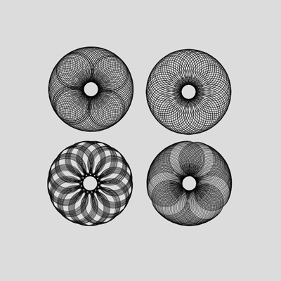

# 1 - Spirograph

This sketch continuously generates new spirographs using the following steps:

1. Set initial angle to 0, and draw a circle in the centre of the page, starting the drawing from the corner.
2. Increment angle by + 1 degree, and draw a circle in the centre of the page, starting the drawing from the corner.
3. Repeat the previous step 100 times
4. Clear the page, increment the new initial angle by + 1, and repeat all steps to draw a different spirograph.

