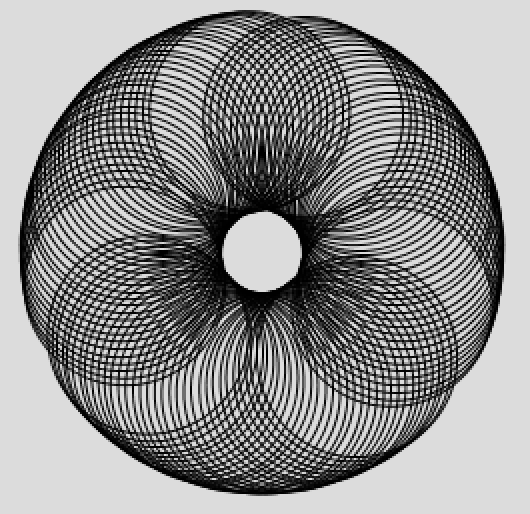

# Spirograph

This sketch continuously generates new spirographs:

1. Draw a circle in the centre of the page
2. Draw another circle in the centre of the page, rotated by angle = 1 degree
3. Repeat the previous step 100 times
4. Set the new angle to 1 + 1 = 2 degrees and repeat the whole process to draw a different spirograph

## Interesting spirographs

