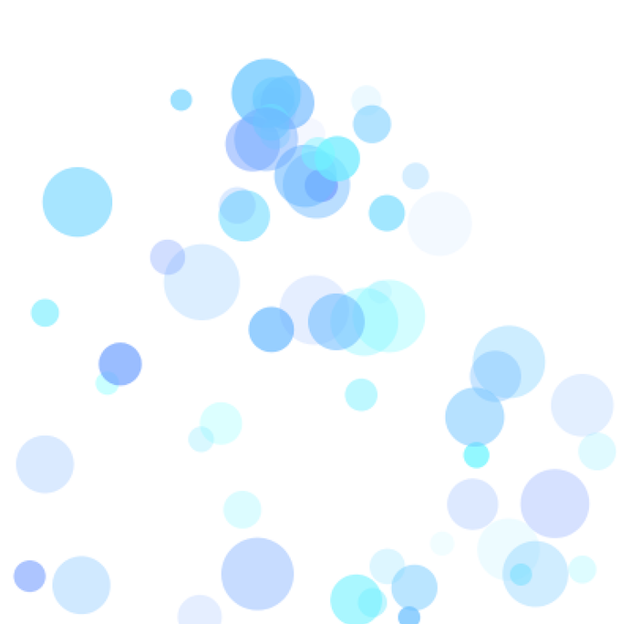

# 3 - soda

A big step up over my previous sketches for sure, I learned to use objects, classes and arrayLists in this sketch.
Click to make more bubbles. The interactive sketch can be found on [OpenProcessing](https://www.openprocessing.org/sketch/426069).

## Brief Explanation (see code for more details)

- When mouse is clicked, create a new object with class `Ball` and add this to the `balls` arrayList.
- The `Ball` class has various attributes associated with it.
- There's visual attributes like the size, opacity and colour.
- There's also a function associated with all objects of class `Ball` called `display()`, which describes its movements and collisions.
